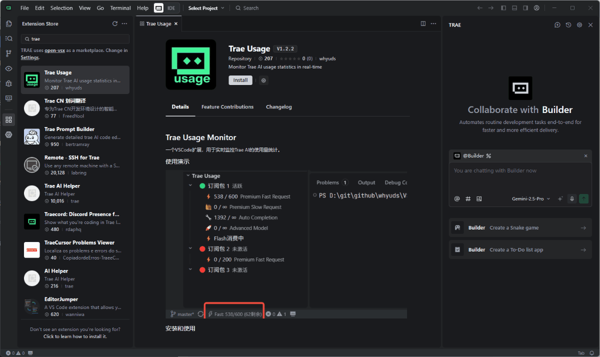

# Trae Usage Monitor

[中文](README.md)

A VSCode extension for real-time monitoring of Trae AI usage statistics.

## Demo

## Installation and Usage

### 1. Installation

Search for "Trae Usage" in the Trae marketplace.

### 2. Get Session ID

**Method 1: Using Browser Extension (Highly Recommended)**

**Chrome Browser:**
1. Install Chrome Extension: [Trae Usage Token Extractor](https://chromewebstore.google.com/detail/edkpaodbjadikhahggapfilgmfijjhei?utm_source=item-share-cb)

**Edge Browser:**
1. Install Edge Extension: [Trae Usage Token Extractor](https://microsoftedge.microsoft.com/addons/detail/trae-usage-token-extracto/leopdblngeedggognlgokdlfpiojalji)

**Usage Steps:**
1. After installation, navigate to install Chrome extension through notifications or TraeUsage window settings
2. After installation, click the Chrome extension icon in browser, then click the jump button to go to Usage page
3. Login and browse the usage page to automatically get Session ID
4. Click the Chrome extension icon to automatically copy Session ID to clipboard
5. Return to Trae, the Trae Usage extension will automatically detect clipboard and configure Session ID

### 3. View Usage

After configuration, a "Trae Usage" view will appear in the VSCode Explorer panel on the left, displaying:

- ⚡ Premium Fast Request: Usage and remaining quota for fast requests
- 🐌 Premium Slow Request: Usage and remaining quota for slow requests
- 🔧 Auto Completion: Usage and remaining quota for auto completion
- 🚀 Advanced Model: Usage and remaining quota for advanced models

## Features

- **Real-time Monitoring**: Automatically refresh usage data at regular intervals
- **Multi-language Support**: Supports both Chinese and English interfaces
- **Visual Status Bar**: Shows current usage status in the status bar
- **Subscription Management**: View subscription packages and their status
- **Automatic Session Detection**: Automatically detects Session ID from clipboard
- **Browser Extension Integration**: Seamless integration with browser extensions

## Configuration

The extension provides the following configuration options:

- **Session ID**: Your Trae AI session identifier
- **Refresh Interval**: How often to refresh usage data (in milliseconds)
- **Language**: Interface language (Auto Detect, Chinese, English)

## Feedback and Support

If you encounter any issues or have feature suggestions, please visit our GitHub project page:

🔗 **Project Repository**: [https://github.com/whyuds/TraeUsage](https://github.com/whyuds/TraeUsage)

💬 **Issue Reporting**: Please submit [Issues](https://github.com/whyuds/TraeUsage/issues) on GitHub for any problems

## License

MIT License