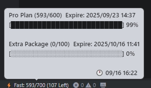

# Trae Usage Monitor

[中文](README.md)

A VSCode extension for real-time monitoring of Trae AI usage statistics.

### Status Bar

### Detailed Dashboard

## Installation and Usage

### 1. Installation Demo

  

### 2. Get Session ID

**Using Browser Extension**

**Chrome Browser:**
1. Install Chrome Extension: [Trae Usage Token Extractor](https://chromewebstore.google.com/detail/edkpaodbjadikhahggapfilgmfijjhei?utm_source=item-share-cb)

**Edge Browser:**
1. Install Edge Extension: [Trae Usage Token Extractor](https://microsoftedge.microsoft.com/addons/detail/trae-usage-token-extracto/leopdblngeedggognlgokdlfpiojalji)

**Usage Steps:**
1. After installation, navigate to install Chrome extension through notifications or TraeUsage window settings
2. After installation, click the Chrome extension icon in browser, then click the jump button to go to Usage page
3. Login and browse the usage page to automatically get Session ID
4. Click the Chrome extension icon to automatically copy Session ID to clipboard
5. Return to Trae, the Trae Usage extension will automatically detect clipboard and configure Session ID
6. Press Ctrl+Shift+P to open command palette, type TraeUsage: Collect Usage Details

### 3. View Usage

After configuration, a "Trae Usage" view will appear in the VSCode Explorer panel on the left, displaying:

- ⚡ Premium Fast Request: Usage and remaining quota for fast requests
- 🐌 Premium Slow Request: Usage and remaining quota for slow requests  
- 🔧 Auto Completion: Usage and remaining quota for auto completion
- 🚀 Advanced Model: Usage and remaining quota for advanced models

## Feedback and Support

If you encounter any issues or have feature suggestions, please visit our GitHub project page:

🔗 **Project Repository**: [https://github.com/whyuds/TraeUsage](https://github.com/whyuds/TraeUsage)

💬 **Issue Reporting**: Please submit [Issues](https://github.com/whyuds/TraeUsage/issues) on GitHub for any problems

## License

MIT License