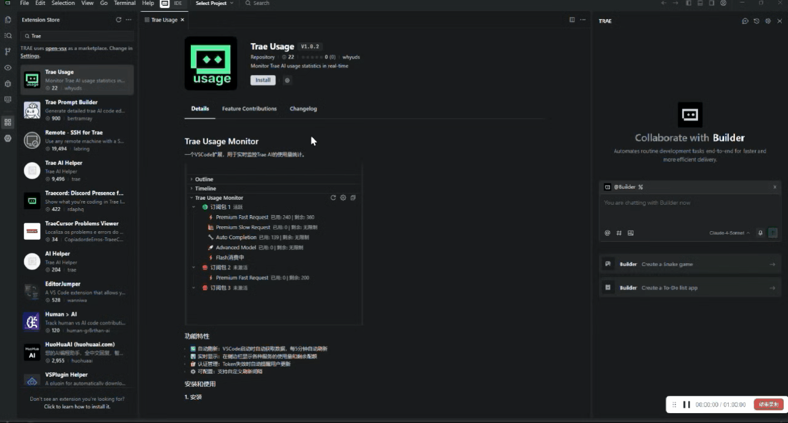
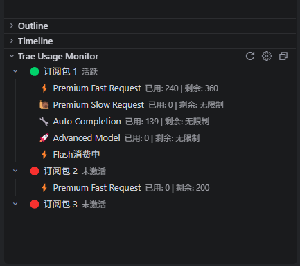

# Trae Usage Monitor

一个VSCode扩展，用于实时监控Trae AI的使用量统计。

## 使用演示

  
  

  <em>左：使用演示 | 右：功能截图</em>

## 安装和使用

### 1. 安装

Trae的应用市场搜索Trae Usage

### 2. 获取Session ID

**方法一：使用浏览器扩展（强烈推荐）**

**Chrome浏览器：**
1. 安装Chrome扩展：[Trae Usage Token Extractor](https://chromewebstore.google.com/detail/edkpaodbjadikhahggapfilgmfijjhei?utm_source=item-share-cb)

**Edge浏览器：**
1. 安装Edge扩展：[Trae Usage Token Extractor](https://microsoftedge.microsoft.com/addons/detail/webelementtracker/leopdblngeedggognlgokdlfpiojalji)

**使用步骤：**
1. 点击扩展图标
2. 点击按钮"Go to Trae Usage Page"
3. 登录并浏览usage页面，自动获取Session ID
4. 点击按钮"Copy Session ID to Clipboard"
5. 返回VSCode，在Trae Usage视图中点击设置按钮，选择"手动输入"并粘贴Session ID

**方法二：手动获取Session ID**

1. 打开浏览器，访问 [Trae AI](https://trae.ai) 并登录
2. 按F12打开开发者工具
3. 切换到"Application"或"存储"标签页
4. 在左侧找到"Cookies" → "https://trae.ai"
5. 找到名为"X-Cloudide-Session"的cookie，复制其值
6. 在VSCode的Trae Usage视图中点击设置按钮，选择"手动输入"并粘贴Session ID

### 3. 查看使用量

配置完成后，在VSCode左侧的资源管理器面板中会出现 "Trae Usage" 视图，显示：

- ⚡ Premium Fast Request：快速请求的使用量和剩余配额
- 🐌 Premium Slow Request：慢速请求的使用量和剩余配额  
- 🔧 Auto Completion：自动补全的使用量和剩余配额
- 🚀 Advanced Model：高级模型的使用量和剩余配额

## 反馈与支持

如果您在使用过程中遇到问题或有功能建议，欢迎访问我们的GitHub项目页面：

🔗 **项目地址**：[https://github.com/whyuds/TraeUsage](https://github.com/whyuds/TraeUsage)

💬 **问题反馈**：如有问题请在GitHub上提交[Issues](https://github.com/whyuds/TraeUsage/issues)

## 许可证

MIT License