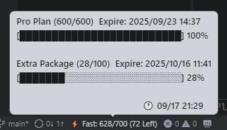
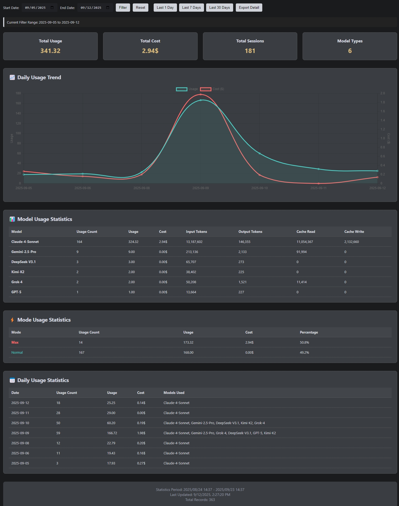

# Trae Usage Monitor

由于原项目出现本人无法使用的问题，并发现有其他用户也遇到了相同问题，因此本人 fork 了原项目，本意是为了帮助优先，但是反馈问题和提交 pr，等待好久无人回应，所以单开一个版本。

一个 VSCode 扩展，用于实时监控 Trae AI 的使用量统计。

## 版本更新

### v1.4.0 (2026-04-21)

- **计费方式更新**：适配官方从次数计费改为 Token 量计费的变更
- **状态栏显示优化**：智能显示订阅计划的基础额度和奖励额度使用情况
- **进度条改进**：区分基础额度（▒）和奖励额度（█）的进度条符号
- **使用详情收集**：修复使用详情收集功能，支持新的 API 接口
- **时间范围计算**：优化时间范围计算逻辑，确保能正确收集历史使用数据

### 状态栏

### 详细看板

## 安装和使用

### 1. 安装演示

  

### 2. 获取 Session ID

**使用浏览器扩展**

**Chrome 浏览器：**

1. 安装 Chrome 扩展：[Trae Usage Token Extractor](https://chromewebstore.google.com/detail/edkpaodbjadikhahggapfilgmfijjhei?utm_source=item-share-cb)

**Edge 浏览器：**

1. 安装 Edge 扩展：[Trae Usage Token Extractor](https://microsoftedge.microsoft.com/addons/detail/trae-usage-token-extracto/leopdblngeedggognlgokdlfpiojalji)

**使用步骤：**

1. 安装后通过通知或 TraeUsage 窗口设置跳转安装 Chrome 扩展
2. 安装后在浏览器点击 Chrome 扩展图标，点击跳转按钮到 Usage 页面
3. 登录并浏览 usage 页面，自动获取 Session ID
4. 点击 Chrome 扩展图标，自动复制 Session ID 至粘贴板
5. 返回 Trae，Trae Usage 扩展会自动识别粘贴板并配置 Session ID
6. Ctrl+Shift+P 打开命令面板，输入 TraeUsage: Collect Usage Details

注意：如果原作者提供的浏览器插件不管用，请自行使用F12工具，在请求中复制请求头Cookie里面的X-Cloudide-Session。例如：X-Cloudide-Session=HfM3FZusMzX2we20bjiXPpvwqcUgr\_zIdpy5-zKFGY=.18a409a3e99e195e; 然后返回Trae

### 3. 查看使用量

配置完成后，在 VSCode 左侧的资源管理器面板中会出现 "Trae Usage" 视图，显示：

- ⚡ Premium Fast Request：快速请求的使用量和剩余配额
- 🐌 Premium Slow Request：慢速请求的使用量和剩余配额
- 🔧 Auto Completion：自动补全的使用量和剩余配额
- 🚀 Advanced Model：高级模型的使用量和剩余配额

## 反馈与支持

如果您在使用过程中遇到问题或有功能建议，欢迎访问我们的 GitHub 项目页面：

🔗 **原项目地址**：<https://github.com/whyuds/TraeUsage>
🔗 **当前项目地址**：<https://github.com/mtpupil/TraeUsage>

💬 **问题反馈**：如有问题请在 GitHub 上提交[Issues](https://github.com/mtpupil/TraeUsage/issues)

## 许可证

MIT License
